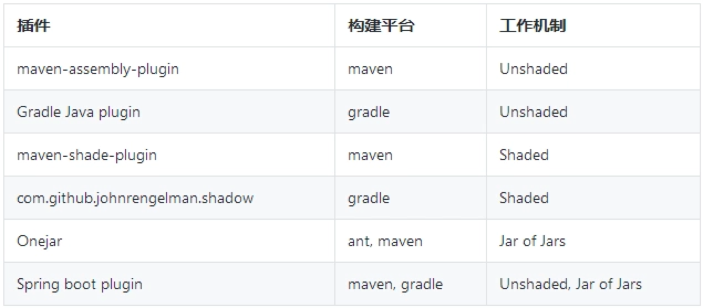

# 一、打包运行
**不打包运行的话，自己编译、运行时需要加依赖。**
- 将一个jar及其依赖的三方jar全部打到一个包中，这个包即为FatJar。

```shell script
  javac -cp ojdbc7.jar ora/OracleJDBCExample.java -d .
  java -cp $CLASSPATH:ojdbc7.jar ora/OracleJDBCExample
```
# 二、三种打包的方法
> 一个正常的 java 程序会有若干个.class 文件和所依赖的第三方库的 jar 文件组成

## 2.1 非遮蔽方法（Unshaded）

```text
    非遮蔽是相对于遮蔽而说的，可以理解为一种朴素的办法。解压所有 jar 文件，再重新打包成一个新的单独的 jar 文件。
```
### Maven Assembly Plugin
```text
    Maven Assembly Plugin 是一个打包聚合插件，其主要功能是把项目的编译输出协同依赖，模块，文档和其他文件打包成一个独立的发布包。
    使用描述符（descriptor）来配置需要打包的物料组合。
    并预定义了常用的描述符，可供直接使用。
    预定义描述符如下：
        * bin 只打包编译结果，并包含 README, LICENSE 和 NOTICE 文件，输出文件格式为 tar.gz, tar.bz2 和 zip。
        * jar-with-dependencies 打包编译结果，并带上所有的依赖，如果依赖的是 jar 包，jar 包会被解压开，平铺到最终的 uber-jar 里去。输出格式为 jar。
        * src 打包源码文件。输出格式为 tar.gz, tar.bz2 和 zip。
        * project 打包整个项目，除了部署输出目录 target 以外的所有文件和目录都会被打包。输出格式为 tar.gz, tar.bz2 和 zip。
```
```xml
<build>
    <plugins>
        <plugin>
            <groupId>org.apache.maven.plugins</groupId>
            <artifactId>maven-compiler-plugin</artifactId>
            <configuration>
                <source>1.8</source>
                <target>1.8</target>
            </configuration>
        </plugin>
        <plugin>
            <artifactId>maven-assembly-plugin</artifactId>
            <configuration>
                <appendAssemblyId>false</appendAssemblyId>
                <descriptorRefs>
                    <descriptorRef>jar-with-dependencies</descriptorRef>
                </descriptorRefs>
                <archive>
                    <manifest>
                        <mainClass>bingo.datalake.DatalakePublish</mainClass>
                    </manifest>
                </archive>
            </configuration>
            <executions>
                <execution>
                    <id>make-assembly</id>
                    <phase>package</phase>
                    <goals>
                        <goal>assembly</goal>
                    </goals>
                </execution>
            </executions>
        </plugin>
    </plugins>
</build>
```
```groovy
apply plugin: 'java'
jar {
    from {
        (configurations.runtime).collect {
            it.isDirectory() ? it : zipTree(it)
        }
    }
}
```
### Gradle Shadow plugin
```text
    gradle 下打包一个非遮蔽的 jar 包，有不少插件可以用，但是由于 gradle 自身的灵活性，可以直接用 groove 的 dsl 实现。
```
## 2.2 遮蔽方法（Shaded）
```text
    遮蔽方法会把依赖包里的类路径进行修改到某个子路径下，这样可以一定程度上避免同名类相互覆盖的问题。
    最终发布的 jar 也不会带入传递依赖冲突问题给下游。
```
### Maven Shade Plugin
```xml
<plugin>
    <groupId>org.apache.maven.plugins</groupId>
    <artifactId>maven-shade-plugin</artifactId>
    <version>3.1.1</version>
    <configuration>
        <!-- put your configurations here -->
    </configuration>
    <executions>
        <execution>
        <phase>package</phase>
        <goals>
            <goal>shade</goal>
        </goals>
        </execution>
    </executions>
 </plugin>
```
### Gradle Shadow plugin
```groovy
plugins {
  id 'com.github.johnrengelman.shadow' version '2.0.4'
  id 'java'
}

shadowJar {
   include '*.jar'
   include '*.properties'
   exclude 'a2.properties'
}
```
- 问题
```text
    遮蔽方法依赖修改 class 的字节码，更新依赖文件的包路径达到规避同名同包类冲突的问题，但是改名也会带来其他问题
    比如代码中使用 Class.forName 或 ClassLoader.loadClass 装载的类，Shade Plugin 是感知不到的。
    同名文件覆盖问题也没法杜绝，比如 META-INF/services/javax.script.ScriptEngineFactory 不属于类文件，但是被覆盖后会出现问题。
```

## 2.3 嵌套方法（Jar of Jars）
```text
    在 jar 包里嵌套其他 jar，这个方法可以彻底避免解压同名覆盖的问题，但是这个方法不被 JVM 原生支持，因为 JDK 提供的 ClassLoader 仅支持装载嵌套 jar 包的 class 文件。
    这种方法需要自定义 ClassLoader 以支持嵌套 jar。
```
### Onejar Maven Plugin
```xml
<plugin>
    <groupId>com.jolira</groupId>
    <artifactId>onejar-maven-plugin</artifactId>
    <version>1.4.4</version>
    <executions>
        <execution>
            <goals>
                <goal>one-jar</goal>
            </goals>
        </execution>
    </executions>
</plugin>
```
### Spring boot plugin
```text
    One-JAR 有点年久失修，好久没有维护了，Spring Boot 提供的 Maven Plugin 也可以打包 Fatjar，支持非遮蔽和嵌套的混合模式，并且支持 maven 和 gradle 。
    requiresUnpack 参数可以定制那些 jar 不希望被解压，采用嵌套的方式打包到 Fatjar 内部。
```
```xml
<plugin>
    <groupId>org.springframework.boot</groupId>
    <artifactId>spring-boot-maven-plugin</artifactId>
    <configuration>
        <layout>ZIP</layout>
        <requiresUnpack>
            <dependency>
                <groupId>org.jruby</groupId>
                <artifactId>jruby-complete</artifactId>
            </dependency>
        </requiresUnpack>
    </configuration>
</plugin>
```
```groovy
plugins {
    id 'org.springframework.boot' version '2.0.4.RELEASE'
}

bootJar {
    requiresUnpack '**/jruby-complete-*.jar'
}
```


