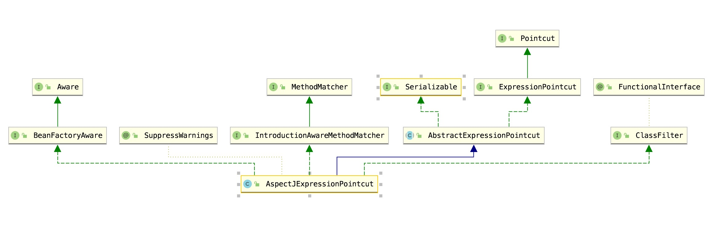
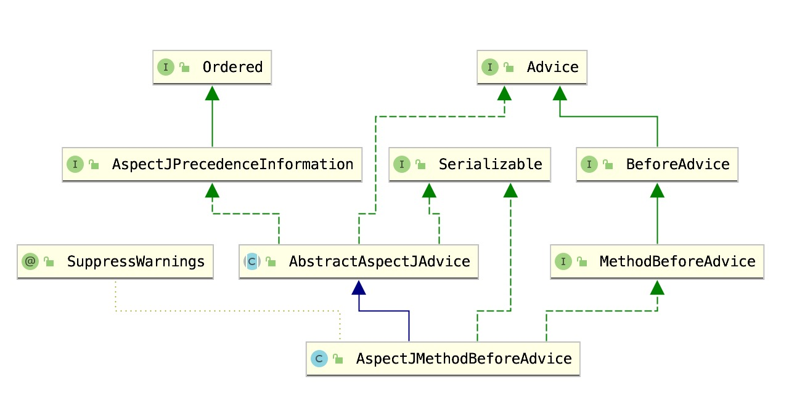
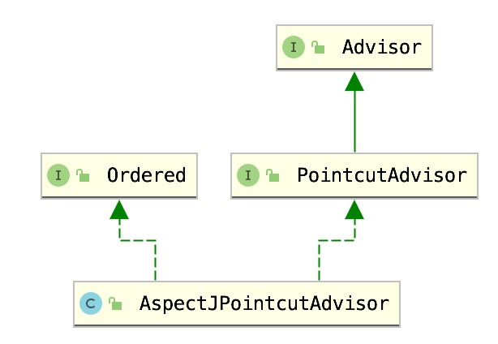

## 一、AOP 概念
### 1.1 通知（Advice）
```text
     通知定义了要织入目标对象的逻辑，以及执行时机。
     Spring 中对应了 5 种不同类型的通知：
     · 前置通知（Before）：在目标方法执行前，执行通知
     · 后置通知（After）：在目标方法执行后，执行通知，此时不关系目标方法返回的结果是什么
     · 返回通知（After-returning）：在目标方法执行后，执行通知
     · 异常通知（After-throwing）：在目标方法抛出异常后执行通知
     · 环绕通知（Around）: 目标方法被通知包裹，通知在目标方法执行前和执行后都被会调用
```
### 1.2 切点（Pointcut）
```text
    如果说通知定义了在何时执行通知，那么切点就定义了在何处执行通知。所以切点的作用就是
    通过匹配规则查找合适的连接点（Joinpoint），AOP 会在这些连接点上织入通知。
    切点是用于选择连接点的。
```
### 1.3 切面（Aspect）
```text
     切面包含了通知和切点，通知和切点共同定义了切面是什么，在何时，何处执行切面逻辑。
```

## 二、JDK 代理、CGLIB 代理
```text
    接口 + 实现类：spring 默认采用 jdk 的动态代理 Proxy。
    实现类：spring 默认采用 CGLIB 代理。
    不能跨越"final"的类来应用横切关注点（或切面），也不能应用于静态和final的方法。因为它们不能被覆盖，从而导致运行时异常。
```
### 强制使用 CGLIB 代理
```text
    如果我们想不管是否有实现接口，都是使用 CGLIB 代理
    修改 EnableAspectJAutoProxy 默认参数，设置 @EnableAspectJAutoProxy(proxyTargetClass=false)
    或者在 xml 上修改 <aop:config proxy-target-class="true"/>
```

## 三、AOP 使用
### 3.1 开启切面自动装配
#### 3.1.1  xml 方式
```xml
<!-- 注意增加 XMl 头文件信息 -->
    <aop:aspectj-autoproxy/>
```
#### 3.1.2  java 方式
- 使用java
```java
@Configuration
@EnableAspectJAutoProxy
public class Config {
}
```
#### 3.2 配置类增加 @AspectJ 注解
> 切面类、Advide 增强类需要增加 @AspectJ 注解
````text
    开启了 @AspectJ 注解配置之后，所有在容器中，被 @AspectJ 注解的 bean 都会被 Spring 当做是 AOP 配置类，称为一个 Aspect。
````
### 3.3 配置切点 Pointcut
> 用于定义哪些方法需要被增强或者说需要被拦截

> 建议将公共的 PointCut 配置全部写在这个一个类里面维护,即自定义切面类
```text
    自定义切面类，里面定义切点，配合 Advice 增强类使用
    使用 @Aspect 、 @Component 注解即可
```

### 3.4 配置 Advice 增强方法
```text
    Aspect 类应该遵守单一职责原则，不要把所有的 Advice 配置全部写在一个Aspect类里面。
    在某些场景下，我们想在 @Before 的时候，去获取方法的入参，比如进行一些日志的记录，我们可以通过 org.aspectj.lang.JoinPoint 来实现。
```
### 3.5 Pointcut 和 Advice 组合使用


## 四、动态代理常用业务场景
### 参数校验和判空
```text
    系统之间在进行接口调用时，往往是有入参传递的，入参是接口业务逻辑实现的先决条件，有时入参的缺失或错误会导致业务逻辑的异常，大量的异常捕获无疑增加了接口实现的复杂度，也让代码显得雍肿冗长，因此提前对入参进行验证是有必要的
    可以提前处理入参数据的异常，并封装好异常转化成结果对象返回给调用方，也让业务逻辑解耦变得独立。
```
### 权限控制
### 无痕埋点
### 安全控制
```text
    比如全局的登录状态流程控制
```
### 日志记录
### 事件防抖
```text
    防止View被连续点击触发多次事件
```
### 性能统计
```text
    检测方法耗时其实已经有一些现成的工具，比如 trace view。
    痛点是这些工具使用起来都比较麻烦，效率低下，而且无法针对某一个块代码或者某个指定的sdk进行查看方法耗时。可以采用 AOP 思想对每个方法做一个切点，在执行之后打印方法耗时。
```
### 事务处理
```text
    声明方法，为特定方法加上事务，指定情况下（比如抛出异常）回滚事务
```
### 异常处理
```text
    替代防御性的 try-Catch
```
### 缓存
```text
    缓存某方法的返回值，下次执行该方法时，直接从缓存里获取。
```
### 软件破解
```text
    使用 Hook 修改软件的验证类的判断逻辑。
```
### 热修复
```text
    AOP 可以让我们在执行一个方法的前插入另一个方法，运用这个思路，我们可以把有 bug 的方法替换成我们下发的新方法。
```


## 五、AOP 原理
### 连接点 - Joinpoint
```text
    连接点是指程序执行过程中的一些点，比如方法调用，异常处理等。在 Spring AOP 中，仅支持方法级别的连接点。每个方法调用都是一个连接点。
```
```java
public interface Invocation extends Joinpoint {
    Object[] getArguments();
}

public interface MethodInvocation extends Invocation {
    Method getMethod();
}
```

### 切点 - Pointcut
```text
    AspectJExpressionPointcut 最终实现了 Pointcut、ClassFilter 和 MethodMatcher 接口，因此该类具备了通过 AspectJ 表达式对连接点进行选择的能力。
```

### 通知 - Advice



### 切面 - Aspect
```text
    切面 Aspect 整合了切点和通知两个模块，切点解决了 where 问题，通知解决了 when 和 how 问题。切面把两者整合起来，就可以解决 对什么方法（where）在何时（when - 前置还是后置，或者环绕）执行什么样的横切逻辑（how）的三连发问题。在 AOP 中，切面只是一个概念，并没有一个具体的接口或类与此对应。不过 Spring 中倒是有一个接口的用途和切面很像，我们不妨了解一下，这个接口就是切点通知器 PointcutAdvisor。

    Advisor 中有一个 getAdvice 方法，用于返回通知。PointcutAdvisor 在 Advisor 基础上，新增了 getPointcut 方法，用于返回切点对象。因此 PointcutAdvisor 的实现类即可以返回切点，也可以返回通知，所以说 PointcutAdvisor 和切面的功能相似。
    Pointcut”。这里在一个切面中，一个切点对应多个通知，是一对多的关系（可以配置多个 pointcut，形成多对多的关系）。而在 PointcutAdvisor 的实现类中，切点和通知是一一对应的关系。上面的通知最终会被转换成两个 PointcutAdvisor
    
```


### 织入 - Weaving
```text
    织入就是在切点的引导下，将通知逻辑插入到方法调用上，使得我们的通知逻辑在方法调用时得以执行。  
    何种方式进行织入?
        这个方式就是通过实现后置处理器 BeanPostProcessor 接口。该接口是 Spring 提供的一个拓展接口，通过实现该接口，用户可在 bean 初始化前后做一些自定义操作。
    在 bean 初始化完成后，即 bean 执行完初始化方法（init-method）后，Spring通过切点对 bean 类中的方法进行匹配。
    若匹配成功，则会为该 bean 生成代理对象，并将代理对象返回给容器。容器向后置处理器输入 bean 对象，得到 bean 对象的代理，这样就完成了织入过程。
```
