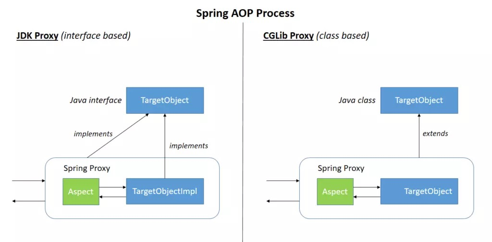
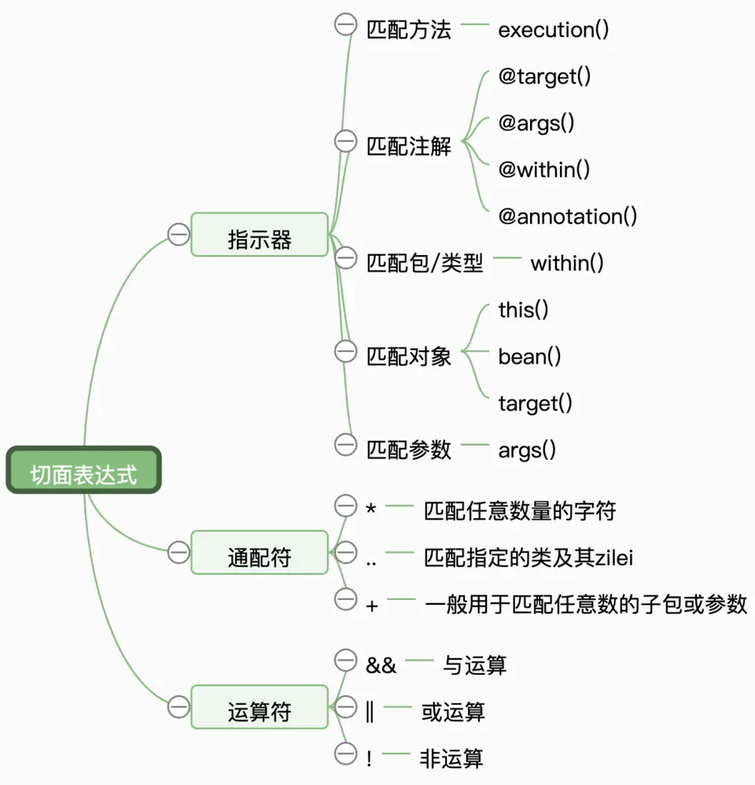

## 一、代理动态 常用业务场景
### 参数校验和判空
```text
    系统之间在进行接口调用时，往往是有入参传递的，入参是接口业务逻辑实现的先决条件，有时入参的缺失或错误会导致业务逻辑的异常，大量的异常捕获无疑增加了接口实现的复杂度，也让代码显得雍肿冗长，因此提前对入参进行验证是有必要的
    可以提前处理入参数据的异常，并封装好异常转化成结果对象返回给调用方，也让业务逻辑解耦变得独立。
```
### 权限控制
### 无痕埋点
### 安全控制
```text
    比如全局的登录状态流程控制
```
### 日志记录
### 事件防抖
```text
    防止View被连续点击触发多次事件
```
### 性能统计
```text
    检测方法耗时其实已经有一些现成的工具，比如 trace view。
    痛点是这些工具使用起来都比较麻烦，效率低下，而且无法针对某一个块代码或者某个指定的sdk进行查看方法耗时。可以采用 AOP 思想对每个方法做一个切点，在执行之后打印方法耗时。
```
### 事务处理
```text
    声明方法，为特定方法加上事务，指定情况下（比如抛出异常）回滚事务
```
### 异常处理
```text
    替代防御性的 try-Catch
```
### 缓存
```text
    缓存某方法的返回值，下次执行该方法时，直接从缓存里获取。
```
### 软件破解
```text
    使用 Hook 修改软件的验证类的判断逻辑。
```
### 热修复
```text
    AOP 可以让我们在执行一个方法的前插入另一个方法，运用这个思路，我们可以把有 bug 的方法替换成我们下发的新方法。
```



## 二、什么时候使用JDK、CGLIB
```text
    JDK动态代理：Spring AOP的首选方法。 每当目标对象实现一个接口时，就会使用JDK动态代理。
    CGLIB代理：如果目标对象没有实现接口，则可以使用CGLIB代理。
    不能跨越"final"的类来应用横切关注点（或切面），也不能应用于静态和final的方法。因为它们不能被覆盖，从而导致运行时异常。
    它使用了运行期织入的方式，因此是无缝集成我们通常的构建过程。
    【AspectJ 在运行时不做任何事情，类和切面是直接编译的。AspectJ 织入切面到代码中，它引入了自己的编译期，称为AspectJ compiler。使用AspectJ，我们需要引入AJC编译器，重新打包所有库（除非我们切换到编译后或加载时织入）】
```
- 如果我们想不管是否有实现接口，都是强制使用Cglib的方式来实现
```text

```
> Spring 提供给了我们对应的配置方式，也就是 proxy-target-class

```java
// 注解方式，修改 EnableAspectJAutoProxy 默认参数
@Configuration
@EnableAspectJAutoProxy(proxyTargetClass=true)
@ComponentScan("com.hnanet.aop")
public class Boostrap {

}
```
```xml
<!-- xml 方式-->
<aop:config proxy-target-class="true"/>
```



## 三、使用
### 开启 @AspectJ 注解配置
````text
    开启了 @AspectJ 注解配置之后，所有在容器中，被 @AspectJ 注解的 bean 都会被 Spring 当做是 AOP 配置类，称为一个 Aspect。
````
- 使用 xml
```xml
    <aop:aspectj-autoproxy/>
```

- 使用java
```java
@Configuration
@EnableAspectJAutoProxy
public class Config {

}
```

### 配置切点 Pointcut
```text
    用于定义哪些方法需要被增强或者说需要被拦截。
    Spring 建议使用 SystemArchitecture 这种切面配置方式，即将一些公共的PointCut 配置全部写在这个一个类里面维护。即自定义切面类。
    
```

### 配置Advice
```text
    Aspect 类应该遵守单一职责原则，不要把所有的Advice配置全部写在一个Aspect类里面。
    在某些场景下，我们想在 @Before 的时候，去获取方法的入参，比如进行一些日志的记录，我们可以通过 org.aspectj.lang.JoinPoint来实现。
```

### 自定义切面类
```text
    自定义切面类使用 @Aspect 、 @Component 注解即可
```