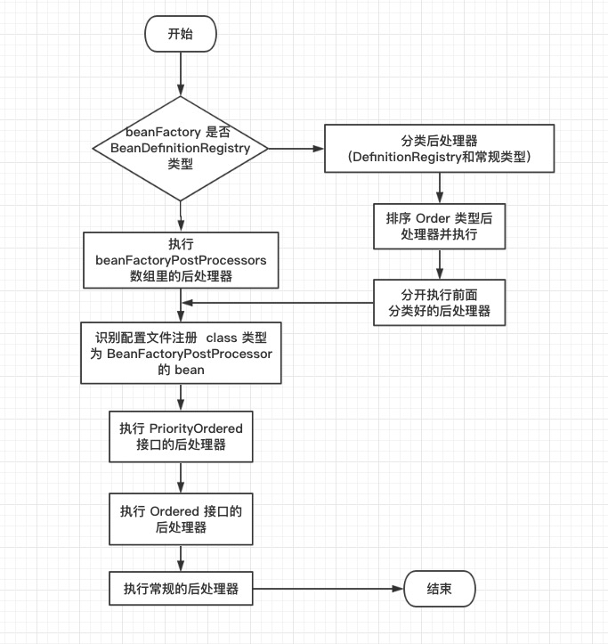

## BeanFactoryPostProcessor 
```java
/**
 * Spring IoC 容器的 BeanFactory 会帮我们对 bean 进行管理，BeanFactoryPostProcessor：主体是 BeanFactory
 * 当 Spring 加载任何实现了 BeanFactoryPostProcessor 接口的 bean 配置时，都会在 bean 工厂载入所有 bean 的配置之后执行 postProcessBeanFactory 方法
 * Spring 对外提供可扩展的接口，能够在容器加载了所有 bean 信息（AbstractApplicationContext#obtainFreshBeanFactory 方法）之后，bean 实例化之前执行，用来修改 bean 的定义属性。
 * 方法参数是 ConfigurableListableBeanFactory beanFactory ，我们可以通过引用该接口，在方法中实现逻辑，对容器中 bean 的定义（配置元数据）进行处理
 * 执行后处理器是有先后顺序的概念，我们可以让 BeanFactoryPostProcessor 实现 Order 接口，通过设置 order 属性来控制它们的执行次序
 */
@FunctionalInterface
public interface BeanFactoryPostProcessor {
	void postProcessBeanFactory(ConfigurableListableBeanFactory beanFactory) throws BeansException;
}
```

> BeanFactoryPostProcessor 是用来对我们 BeanFactory 中的 BeanDefinition 进行处理，此时Bean完成加载，还未实例化。
```text
    他有两个重要的子类，一个是 PropertyPlaceholderConfigurer，另一个是 PropertyOverrideConfigurer 
```
### 注册定制的属性编辑器
> 继承 BeanFactoryPostProcessor ，进行敏感词过滤

### PropertyPlaceholderConfigurer
> 使用 Properties 里的配置信息,来替换 bean 中定义的占位符

你可以使用 PropertyPlaceholderConfigurer 从一个独立的使用标准 Java Properties 格式的文件来表达一个bean 定义的属性值。这样做让人们根据环境特定的属性来部署应用，如数据库 URLs 和密码，没有了修改主配置 XML文件或者容器文件的复杂和风险。
```xml
<context:property-placeholder location="classpath:jdbc.properties"/>
<bean class="org.springframework.beans.factory.config.PropertyPlaceholderConfigurer">
   <property name="locations">
       <value>classpath:com/something/strategy.properties</value>
   </property>
   <property name="properties">
       <value>custom.strategy.class=com.something.DefaultStrategy</value>
   </property>
</bean>
```
```xml

<bean id="serviceStrategy" class="${custom.strategy.class}"/>
```
PropertyPlaceholderConfigurer 不仅在你限定的 Properties 文件里查找属性。默认情况下，如果不能再特定属性文件中找到属性，它也会在 Java 的System 属性上检查。你可以通过设置配置对象的 systemPropertiesMode 属性定制这个行为，以下是它所支持的三个整数值：
never（0）：从不检查系统属性。
fallback（1）：如果在给定属性文件没有解析到，就检查系统属性。这是默认的行为。
override（2）：在解析特定属性文件之前，首先检查系统属性。这使得系统属性可以覆盖任何其他属性源。

### PropertyOverrideConfigurer
> 使用 properties 对配置信息，对 bean 的配置信息进行覆盖替换
```xml
<context:property-override location="classpath:override.properties"/>
```
```xml
<bean class="org.springframework.beans.factory.config.PropertyOverrideConfigurer">
    <property name="locations">
        <list>
            <value>classpath:propertyOverrideConfigurer.properties</value>
        </list>
    </property>
</bean>
```
```properties
# beanName.propertyName=value
dataSource.driverClassName=com.mysql.jdbc.Driver
dataSource.url=jdbc:mysql:mydb
```

## spring 如何识别和分析 BeanFactoryPostProcessor
> org.springframework.context.support.AbstractApplicationContext#invokeBeanFactoryPostProcessors
--- 
> 委派了 PostProcessorRegistrationDelegate.invokeBeanFactoryPostProcessors(beanFactory, getBeanFactoryPostProcessors()) 代理进行执行

>

```java
public static void invokeBeanFactoryPostProcessors(ConfigurableListableBeanFactory beanFactory, List<BeanFactoryPostProcessor> beanFactoryPostProcessors) {
	Set<String> processedBeans = new HashSet<>();
	// beanFactory 默认使用的是 DefaultListableBeanFactory，属于 BeanDefinitionRegistry
	if (beanFactory instanceof BeanDefinitionRegistry) {
		BeanDefinitionRegistry registry = (BeanDefinitionRegistry) beanFactory;
		// 两个后处理器列表
		List<BeanFactoryPostProcessor> regularPostProcessors = new ArrayList<>();
		List<BeanDefinitionRegistryPostProcessor> registryProcessors = new ArrayList<>();
		// 硬编码注册的后处理器
		for (BeanFactoryPostProcessor postProcessor : beanFactoryPostProcessors) {
			// 分类处理
		}
		List<BeanDefinitionRegistryPostProcessor> currentRegistryProcessors = new ArrayList<>();
		// 首先，调用实现 priorityOrder 的 beanDefinition 这就是前面提到过的优先级概念，这一步跟下面的优先级不一样之处，这一步的优先级是带有权重
		String[] postProcessorNames = beanFactory.getBeanNamesForType(BeanDefinitionRegistryPostProcessor.class, true, false);
		for (String ppName : postProcessorNames) {
			if (beanFactory.isTypeMatch(ppName, PriorityOrdered.class)) {
				currentRegistryProcessors.add(beanFactory.getBean(ppName, BeanDefinitionRegistryPostProcessor.class));
				processedBeans.add(ppName);
			}
		}
		// 对后处理器进行排序
		sortPostProcessors(currentRegistryProcessors, beanFactory);
		registryProcessors.addAll(currentRegistryProcessors);
		invokeBeanDefinitionRegistryPostProcessors(currentRegistryProcessors, registry);
		currentRegistryProcessors.clear();
		// Next, invoke the BeanDefinitionRegistryPostProcessors that implement Ordered.
		postProcessorNames = beanFactory.getBeanNamesForType(BeanDefinitionRegistryPostProcessor.class, true, false);
		for (String ppName : postProcessorNames) {
			if (!processedBeans.contains(ppName) && beanFactory.isTypeMatch(ppName, Ordered.class)) {
				currentRegistryProcessors.add(beanFactory.getBean(ppName, BeanDefinitionRegistryPostProcessor.class));
				processedBeans.add(ppName);
			}
		}
		sortPostProcessors(currentRegistryProcessors, beanFactory);
		registryProcessors.addAll(currentRegistryProcessors);
		// 执行 definitionRegistryPostProcessor 接口的方法 ：postProcessBeanDefinitionRegistry
		invokeBeanDefinitionRegistryPostProcessors(currentRegistryProcessors, registry);
		currentRegistryProcessors.clear();
		// Finally, invoke all other BeanDefinitionRegistryPostProcessors until no further ones appear.最后，调用所有其他后处理器，直到不再出现其他 bean 为止
		boolean reiterate = true;
		while (reiterate) {
			reiterate = false;
			postProcessorNames = beanFactory.getBeanNamesForType(BeanDefinitionRegistryPostProcessor.class, true, false);
			for (String ppName : postProcessorNames) {
				if (!processedBeans.contains(ppName)) {
					currentRegistryProcessors.add(beanFactory.getBean(ppName, BeanDefinitionRegistryPostProcessor.class));
					processedBeans.add(ppName);
					reiterate = true;
				}
			}
			sortPostProcessors(currentRegistryProcessors, beanFactory);
			registryProcessors.addAll(currentRegistryProcessors);
			invokeBeanDefinitionRegistryPostProcessors(currentRegistryProcessors, registry);
			currentRegistryProcessors.clear();
		}
		// 执行 postProcessBeanFactory 回调方法
		invokeBeanFactoryPostProcessors(registryProcessors, beanFactory);
		invokeBeanFactoryPostProcessors(regularPostProcessors, beanFactory);
	}
	else {
		invokeBeanFactoryPostProcessors(beanFactoryPostProcessors, beanFactory);
	}
	// 不要在这里初始化 factoryBean:我们需要保留所有常规 bean 未初始化，以便让 bean 工厂后处理程序应用于它们
	// 注释 6.4 在这个步骤中，我们自定义的 carBeanFactoryPostProcessor 才真正注册并执行
	String[] postProcessorNames =
			beanFactory.getBeanNamesForType(BeanFactoryPostProcessor.class, true, false);.
    // 跳过分类的逻辑
	// 首先执行的是带有权重顺序的后处理器
	sortPostProcessors(priorityOrderedPostProcessors, beanFactory);
	invokeBeanFactoryPostProcessors(priorityOrderedPostProcessors, beanFactory);
	// 下一步执行普通顺序的后处理器
	List<BeanFactoryPostProcessor> orderedPostProcessors = new ArrayList<>(orderedPostProcessorNames.size());
	for (String postProcessorName : orderedPostProcessorNames) {
		orderedPostProcessors.add(beanFactory.getBean(postProcessorName, BeanFactoryPostProcessor.class));
	}
	sortPostProcessors(orderedPostProcessors, beanFactory);
	invokeBeanFactoryPostProcessors(orderedPostProcessors, beanFactory);
	// 最后执行的是普通的后处理器
	List<BeanFactoryPostProcessor> nonOrderedPostProcessors = new ArrayList<>(nonOrderedPostProcessorNames.size());
	for (String postProcessorName : nonOrderedPostProcessorNames) {
		nonOrderedPostProcessors.add(beanFactory.getBean(postProcessorName, BeanFactoryPostProcessor.class));
	}
	invokeBeanFactoryPostProcessors(nonOrderedPostProcessors, beanFactory);
	// 清除缓存的合并bean定义，因为后处理程序可能已经修改了原始元数据，例如替换值中的占位符
	beanFactory.clearMetadataCache();
}
```
