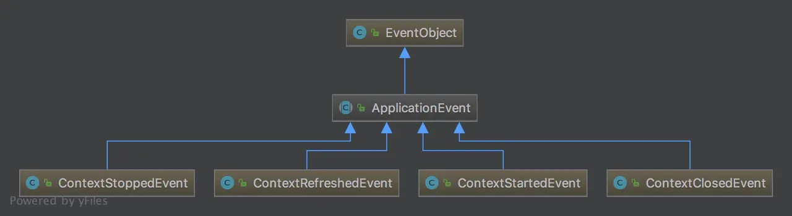

## 一、JAVA 事件监听机制基础类
### 1.1 EventObject
```text
    自定义事件类型扩展自 java.util.EventObject
```
### 1.2 EventListener
```text
    事件的监听器扩展自 java.util.EventListener
```
```text
    在合适的时机发布事件：事件发布是顺序执行，为了不影响处理性能，事件监听器的处理逻辑应尽量简单。
    事件监听器的管理：如果这里没有提供remove方法，那么注册的监听器示例将一直被MethodMonitorEventPublisher引用，这会导致隐性的内存泄漏。
```
## 二、Spring 事件监听机制基础类

### 2.1 ApplicationEvent
```text
    Spring的ApplicationContext 容器内部中的所有事件类型均继承自 org.springframework.context.AppliationEvent
```
### 2.2 ApplicationListener
```text
    容器中的所有监听器都实现org.springframework.context.ApplicationListener接口，并且以bean的形式注册在容器中，一旦在容器内发布 ApplicationEvent 及其子类型的事件，注册到容器的 ApplicationListener 就会对这些事件进行处理。
    ApplicationListener 继承自 EventListener。
```
### 2.3 ApplicationContext 事件发布者
```text
    ApplicationContext 接口继承了 ApplicationEventPublisher 接口，ApplicationContext 容器担当的就是事件发布者的角色。
    容器在启动时，会自动识别并加载EventListener类型的bean，一旦容器内有事件发布，将通知这些注册到容器的EventListener。
    ApplicationContext 将事件的发布以及监听器的管理工作委托给 ApplicationEventMulticaster 接口的实现类。  
    在容器启动时，会检查容器内是否存在名为 applicationEventMulticaster 的 ApplicationEventMulticaster 对象实例。如果有就使用其提供的实现，没有就默认初始化一个 SimpleApplicationEventMulticaster 作为实现。
```
## 2.4 在容器内部发布事件
```text
    如果我们业务需要在容器内部发布事件，只需要为其注入 ApplicationEventPublisher 依赖即可。
    实现 ApplicationEventPublisherAware 接口或者 ApplicationContextAware 接口。（Aware接口，其作用就是在对象实例化完成以后将Aware接口定义中规定的依赖注入到当前实例中。ps：实现了 ApplicationContextAware 接口的类都可以获取到一个 ApplicationContext 对象）
```
```text
    demo：在用户注册成功后发布事件，事件监听者监听到用户注册成功的事件后，触发发送邮件和发送短信的业务。
    由于要触发发送邮件和短信，因此要从事件发布者那里获取对应的邮件地址和手机号码，而这些信息是通过事件这个桥梁进行连接的，所以，事件中必须包含邮件地址和手机号码这两个属性。
```



## 三、Spring 事件应用
### Spring Security 处理用户认证信息
```java
// Spring Security 中使用 AuthenticationEventPublisher 处理用户认证成功，认证失败的消息处理。
public interface AuthenticationEventPublisher {

   void publishAuthenticationSuccess(Authentication authentication);

   void publishAuthenticationFailure(AuthenticationException exception,
         Authentication authentication);
}
```
```text
    Hibernate 中持久化对象属性的修改是如何被框架得知的？
    正是采用了一系列持久化相关的事件，如 DefaultSaveEventListener，DefaultUpdateEventListener
```
### Spring Cloud Zuul 刷新路由
```java
// Spring Cloud Zuul 中刷新路由信息使用到的 ZuulRefreshListener
private static class ZuulRefreshListener implements ApplicationListener<ApplicationEvent> {
        @Autowired
        private ZuulHandlerMapping zuulHandlerMapping;
        private HeartbeatMonitor heartbeatMonitor;

        private ZuulRefreshListener() {
            this.heartbeatMonitor = new HeartbeatMonitor();
        }

        public void onApplicationEvent(ApplicationEvent event) {
            if (!(event instanceof ContextRefreshedEvent) && !(event instanceof RefreshScopeRefreshedEvent) && !(event instanceof RoutesRefreshedEvent) && !(event instanceof InstanceRegisteredEvent)) {
                if (event instanceof ParentHeartbeatEvent) {
                    ParentHeartbeatEvent e = (ParentHeartbeatEvent)event;
                    this.resetIfNeeded(e.getValue());
                } else if (event instanceof HeartbeatEvent) {
                    HeartbeatEvent e = (HeartbeatEvent)event;
                    this.resetIfNeeded(e.getValue());
                }
            } else {
                this.reset();
            }

        }

        private void resetIfNeeded(Object value) {
            if (this.heartbeatMonitor.update(value)) {
                this.reset();
            }

        }

        private void reset() {
            this.zuulHandlerMapping.setDirty(true);
        }
    }
```
## spring 生命周期相关的 Event
> ApplicationEvent 继承自 EventObject，Spring提供了一些默认的实现。

```text
    ContextClosedEvent表示容器在即将关闭时发布的事件类型，ContextRefreshedEvent表示容器在初始化或者刷新的时候发布的事件类型。
    ContextRefreshedEvent ：ApplicationContext 初始化或刷新完成后触发的事件
    RequestHandledEvent
    ContextStartedEvent ：ApplicationContext 启动后触发的事件
    ContextStoppedEvent ：ApplicationContext 停止后触发的事件
    ContextClosedEvent ：ApplicationContext 关闭后触发的事件。如web容器关闭时自动会触发Spring容器的关闭，如果是普通java应用，需要调用ctx.registerShutdownHook()注册虚拟机关闭时的钩子才行；
```