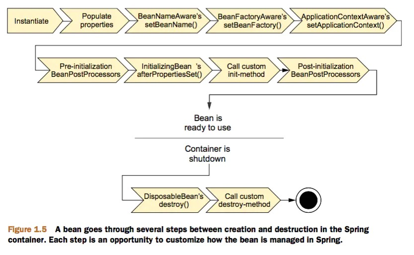

- Spring Bean的生命周期:

1. Bean容器找到配置文件中Spring Bean的定义。
2. Bean容器利用Java Reflection API创建一个Bean的实例。
3. 如果涉及到一些属性值 利用set方法设置一些属性值。
4. 如果Bean实现了 BeanNameAware 接口，调用setBeanName()方法，传入Bean的名字。
5. 如果Bean实现了 BeanClassLoaderAware 接口，调用setBeanClassLoader()方法，传入ClassLoader对象的实例。
6. 如果Bean实现了 BeanFactoryAware 接口，调用setBeanClassLoader()方法，传入ClassLoader对象的实例。
7. 与上面的类似，如果实现了其他*Aware接口，就调用相应的方法。
8. 如果有和加载这个Bean的Spring容器相关的 BeanPostProcessor 对象，执行postProcessBeforeInitialization()方法
9. 如果Bean实现了 InitializingBean 接口，执行afterPropertiesSet()方法。
10. 如果Bean在配置文件中的定义包含 init-method 属性，执行指定的方法。
11. 如果有和加载这个Bean的Spring容器相关的 BeanPostProcessor 对象，执行postProcessAfterInitialization()方法
12. 当要销毁Bean的时候，如果Bean实现了 DisposableBean 接口，执行destroy()方法。
13. 当要销毁Bean的时候，如果Bean在配置文件中的定义包含destroy-method属性，执行指定的方法。

--- 

--- 
