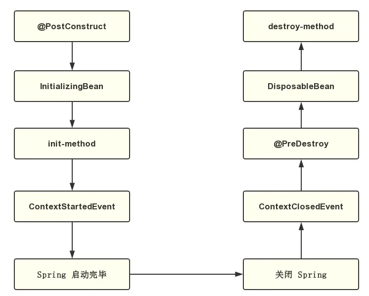

## 一、Spring Bean 初始化/销毁 方式
### 1.1. init-method/destroy-method
    在配置文件或利用注解指定初始化/销毁方法
    
### 1.2. InitializingBean/DisposableBean
    这种方式需要继承 Spring 接口 InitializingBean/DisposableBean。
    其中 InitializingBean 用于初始化动作，而 DisposableBean 用于销毁之前清理动作。
    注意继承之后要配置 XMl 文件或利用注解的方式注册Bean。

### 1.3. @PostConstruct/@PreDestroy
    这种方式相对于上面两种方式来说，使用方式最简单，只需要在相应的方法上使用注解即可。
    注意需要配置 XML 文件或者利用注解方式注册Bean。
    如果使用 JDK9 之后版本 ，@PostConstruct/@PreDestroy 需要使用 maven 单独引入 javax.annotation-api，否者注解不会生效。
```java
@Service
public class HelloService {


    @PostConstruct
    public void init() {
        System.out.println("hello @PostConstruct");
    }

    @PreDestroy
    public void PreDestroy() {
        System.out.println("hello @PreDestroy");
    }
}
```

### 1.4. ContextStartedEvent/ContextClosedEvent
    Spring 启动之后将会发送 ContextStartedEvent 事件，而关闭之前将会发送 ContextClosedEvent 事件。
    我们需要继承 Spring ApplicationListener 才能监听以上两种事件。
    可以监听 ContextRefreshedEvent 事件代替。一旦 Spring 容器初始化完成，就会发送 ContextRefreshedEvent。
```java
@Service
public class HelloListener implements ApplicationListener {

    @Override
    public void onApplicationEvent(ApplicationEvent event) {
        if(event instanceof ContextClosedEvent){
            System.out.println("hello ContextClosedEvent");
        }else if(event instanceof ContextStartedEvent){
            System.out.println("hello ContextStartedEvent");
        }

    }
}

// 或者利用 @EventListener注解
public class HelloListenerV2 {
    
    @EventListener(value = {ContextClosedEvent.class, ContextStartedEvent.class})
    public void receiveEvents(ApplicationEvent event) {
        if (event instanceof ContextClosedEvent) {
            System.out.println("hello ContextClosedEvent");
        } else if (event instanceof ContextStartedEvent) {
            System.out.println("hello ContextStartedEvent");
        }
    }
}

```
### 1.5 执行顺序



---
 

## 二、比较重要的两个接口
### 2.1. *Aware 接口
    可以用于在初始化 bean 时获得 Spring 中的一些对象，如获取 Spring 上下文等
    
### 2.2. BeanPostProcessor 接口
    Spring 中所有 bean 在做初始化时都会调用该接口中的两个方法，可以用于对一些特殊的 bean 进行处理


## 三、Spring Bean的生命周期

> Spring 只帮我们管理单例模式 Bean 的完整生命周期，对于 prototype 的 bean ，Spring 在创建好交给使用者之后则不会再管理后续的生命周期。

``` text
1. Bean容器找到配置文件中Spring Bean的定义。
2. Bean容器利用Java Reflection API创建一个Bean的实例。
3. 如果涉及到一些属性值 利用set方法设置一些属性值。
4. 如果Bean实现了 BeanNameAware 接口，调用setBeanName()方法，传入Bean的名字。
5. 如果Bean实现了 BeanClassLoaderAware 接口，调用setBeanClassLoader()方法，传入ClassLoader对象的实例。
6. 如果Bean实现了 BeanFactoryAware 接口，调用setBeanClassLoader()方法，传入ClassLoader对象的实例。
7. 与上面的类似，如果实现了其他*Aware接口，就调用相应的方法。
8. 如果有和加载这个Bean的Spring容器相关的 BeanPostProcessor 对象，执行postProcessBeforeInitialization()方法
9. 如果Bean实现了 InitializingBean 接口，执行afterPropertiesSet()方法。
10. 如果Bean在配置文件中的定义包含 init-method 属性，执行指定的方法。
11. 如果有和加载这个Bean的Spring容器相关的 BeanPostProcessor 对象，执行postProcessAfterInitialization()方法
12. 当要销毁Bean的时候，如果Bean实现了 DisposableBean 接口，执行destroy()方法。
13. 当要销毁Bean的时候，如果Bean在配置文件中的定义包含destroy-method属性，执行指定的方法。
```
--- 


--- 

## 三、Bean 接口方法
### 3.1 分类
    Bean的完整生命周期经历了各种方法调用，这些方法可以划分为以下几类：
```text
1、Bean自身的方法
    这个包括了Bean本身调用的方法和通过配置文件中<bean>的 init-method 和 destroy-method 指定的方法
2、Bean级生命周期接口方法
    这个包括了 BeanNameAware 、 BeanFactoryAware 、 InitializingBean 和 DiposableBean 这些接口的方法
3、容器级生命周期接口方法
    这个包括了 InstantiationAwareBeanPostProcessor 和 BeanPostProcessor 这两个接口实现，一般称它们的实现类为“后处理器”。
4、工厂后处理器接口方法
    这个包括了 AspectJWeavingEnabler 、 ConfigurationClassPostProcessor 、 CustomAutowireConfigurer 等等非常有用的工厂后处理器接口的方法。
    工厂后处理器也是容器级的。在应用上下文装配配置文件之后立即调用。
```
### 3.2 演示

> 代码在 interfaceMethod 目录下
```text
1. Persion 类
    调用Bean自身的方法和Bean级生命周期接口方法，为了方便演示，它实现了BeanNameAware、BeanFactoryAware、InitializingBean和DiposableBean这4个接口，
    同时有2个方法，对应配置文件中<bean>的init-method和destroy-method
2. MyBeanPostProcessor 实现 BeanPostProcessor 接口
    BeanPostProcessor 接口包括2个方法 postProcessAfterInitialization 和 postProcessBeforeInitialization
    这两个方法的第一个参数都是要处理的Bean对象，第二个参数都是Bean的name。返回值也都是要处理的Bean对象。
3. MyInstantiationAwareBeanPostProcessor 继承 InstantiationAwareBeanPostProcessorAdapter
    InstantiationAwareBeanPostProcessor 接口本质是 BeanPostProcessor 的子接口
    一般我们继承Spring为其提供的适配器类 InstantiationAwareBeanPostProcessorAdapter 来使用它
    这个有3个方法，其中第二个方法postProcessAfterInitialization就是重写了BeanPostProcessor的方法。第三个方法postProcessPropertyValues用来操作属性，返回值也应该是PropertyValues对象。
4. MyBeanFactoryPostProcessor 工厂后处理器接口方法
```
