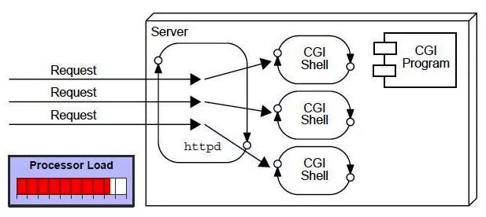
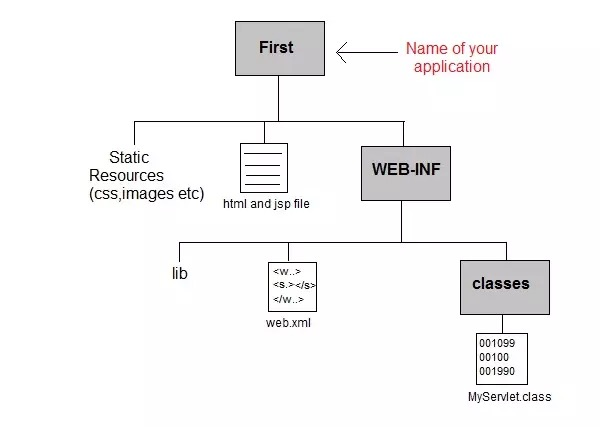

## CGI（通用网关接口）
```text
    CGI 即使可以让服务器能够调用外部程序，并将HTTP请求信息传递给外部程序处理，对于每一个请求，会启动一个新的进程。
    CGI 技术的缺点
        客户端数量增加时，响应时间更多
        每一个其请求，需要启动一个新的进程，消耗大量的系统资源
        使用平台依赖语言，如：C、C++、Perl
```


## 为什么有 Servlet
```text
    Servlet 是 J2EE 规范之一，在遵守该规范的前提下，我们可将 Web 应用部署在 Servlet 容器下。
    可使开发者聚焦业务逻辑，而不用去关心 HTTP 协议方面的事情。
    如果我们基于 Servlet 规范实现 Web 应用的话，HTTP 协议的处理过程就不需要我们参与了。这些工作交给 Servlet 容器就行了，我们只需要关心业务逻辑怎么实现即可。
    Servlet 优势
        更好的性能：每个请求创建的是线程，而不是进程
        可移植性：使用Java跨平台语言
        更强大：Servlet有JVM管理，不需要担心内存泄露、溢出等
```

## Servlet 基本目录
```text
    在 tomcat/webapps 目录下创建下述目录结构
    1. 所有 HTML，静态文件直接保存在应用程序目录下
    2. 所有的 Servlet 类保存在 WEB-INF/classe 目录或子目录下
    3. web.xml（部署描述符）文件保存在 WEB-INF 目录下
```


## Servlet 继承关系
```text
Servlet(interface)->init(),service(),destroy();
^ 
GenericServlet(abstract class)->协议无关的 servlet，是一个比较原始的实现，通常我们不会直接继承该类。
^
HttpServlet(abstract class)->实现了http协议，根据请求方式调用调用不同的方法，一般需要复写doGet/doPost方法
```


## Servlet & ServletConfig
```java
public interface Servlet {

    /**
     * 
     * init 方法会在容器启动时由容器调用，也可能会在 Servlet 第一次被使用时调用，调用时机取决 load-on-start 的配置。只会被调用一次
     * 容器调用 init 方法时，会向其传入一个 ServletConfig 参数
     * xml 文件的配置信息最终会被放入 ServletConfig 实现类对象中。DispatcherServlet 通过 ServletConfig 接口中的方法，就能获取到 contextConfigLocation 对应的值。
     * 参数包含了 Serlvet 的配置信息。通常情况下，我们在 web.xml 文件中定义 Serlvet 时，会通过 init-param 标签来进行参数配置。
     */
    public void init(ServletConfig config) throws ServletException;

    public ServletConfig getServletConfig();

    /**
     * service 方法用于处理请求，业务逻辑在 service 中编写
     * 一般情况下我们不会直接实现 Servlet 接口，通常是通过继承 HttpServlet 抽象类编写业务逻辑
     */
    public void service(ServletRequest req, ServletResponse res) throws ServletException, IOException;
   
    /**
     * 用于获取 Servlet 相关的信息：版权等
     */
    public String getServletInfo();
    
    /**
     * 和init一样，只会被调用一次，一般在服务器关闭时用于释放一些资源。
     */
    public void destroy();
}

public interface ServletConfig {
    
    /**
     * 获取Servlet的名字，即在 web.xml 中定义的 servlet-name
     */
    public String getServletName();

    /**
     * 用于获取 Servlet 上下文。ServletContext 代表当前的 Web 应用本身
     * 可通过标签向 ServletContext 中配置信息
     */
    public ServletContext getServletContext();

    /**
     * 用于获取 init-param 中配置的参数
     */
    public String getInitParameter(String name);

    /**
     * 用于获取所有init-param配置名字的集合
     */
    public Enumeration<String> getInitParameterNames();
}

```
## 问题
### Servlet 什么时候创建
```text
    默认第一次访问时被创建,<load-on-startup>默认值为负数
    可以修改为0或整数，将在服务器启动时被创建
```

### ServletContext 作用
#### 读取资源文件
```text
    1.
        ServletContext servletContext = this.getServletContext();
        InputStream inputStream = servletContext.getResourceAsStream("/WEB-INF/classes/zhongfucheng/web/1.png");
    2. 文件放在 web 目录下，直接通过文件名称就能获取
        ServletContext servletContext = this.getServletContext();
        InputStream inputStream = servletContext.getResourceAsStream("2.png");
    3. 文件放在 src 目录（类目录）下，通过类装载器获取，如果文件太大，就不能用类装载器的方式去读取，会导致内存溢出
        ClassLoader classLoader = Servlet111.class.getClassLoader();
        InputStream inputStream = classLoader.getResourceAsStream("3.png");
```
#### 获取全局参数，获取 WEB 应用的初始化参数
#### servlet域对象
```text
    域对象相当于一个容器，可以从一个servlet中用ServletContext存入数据；
    从另一个servlet中用ServletContext读取数据
```

#### 使用 ServletContext 实现跳转
```text
    跳转实现
        1. response.sendRedirect("/web应用名/资源名");
        2. request.getRequestDispatcher("/资源名").forward(request, response);
        3. this.getServletContext().getRequestDispatcher("/资源url").forward(request, response);
    区别
        1. getRequestDispatcher 一个跳转发生在web服务器 sendRedirect发生在浏览器
        2. 如果request.setAttribute("name","Switch") 希望下一个页面可以使用属性值，则使用 getRequestDispatcher
        3. 如果session.setAttribute("name2","Switch2"), 希望下一个页面可以使用属性值，则两个方法均可使用,但是建议使用 getRequestDispatcher
        4. 如果我们希望跳转到本web应用外的一个url,应使用sendRedirect
```
### ServletConfig vs ServletContext
```text
    ServletConfig 获取的是配置的是单个 Servlet 的参数信息
    ServletContext 可以获取的是配置整个 web 站点的参数信息
```

### Servlet 单例和线程安全
```text
    浏览器多次对 某个类型的 Servlet 的请求，一般情况下，服务器只创建一个 该类型的 Servlet 对象，也就是说，某个类型的 Servlet 对象一旦创建了，就会驻留在内存中，为后续的请求做服务，直到服务器关闭。
    对于每次访问请求，Servlet引擎都会创建一个新的HttpServletRequest请求对象和一个新的HttpServletResponse响应对象，然后将这两个对象作为参数传递给它调用的Servlet的service()方法，service方法再根据请求方式分别调用doXXX方法。
    线程安全问题
        当多个用户访问Servlet的时候，服务器会为每个用户创建一个线程。当多个用户并发访问Servlet共享资源的时候就会出现线程安全问题。
        如果一个变量需要多个用户共享，则应当在访问该变量的时候，加同步机制synchronized (对象){}
        如果一个变量不需要共享，则直接在 doGet() 或者 doPost()定义.这样不会存在线程安全问题
```

## 使用后注解方式配置 Servlet
* Servlet 3.0 以上可以使用使用注解的方式替代 xml 文件
```text
    @WebServlet(urlPatterns={"/test","/test/*","*.do"})
```


## HTTP
* 传输协议：定义了，客户端和服务器端通信时，发送数据的格式
* Hyper Text Transfer Protocol 超文本传输协议
* 请求方式：
    * HTTP协议有7中请求方式，常用的有2种
        * GET：
            1. 请求参数在请求行中，在url后。
            2. 请求的url长度有限制的
            3. 不太安全
        * POST：
            1. 请求参数在请求体中
            2. 请求的url长度没有限制的
            3. 相对安全
### 特点
    1. 基于TCP/IP的高级协议
    2. 默认端口号:80
    3. 基于请求/响应模型的:一次请求对应一次响应
    4. 无状态的：每次请求之间相互独立，不能交互数据
### 历史版本
    * 1.0：每一次请求响应都会建立新的连接
    * 1.1：复用连接

### 请求消息
1. 请求行
```text
    请求方式 请求url 请求协议/版本
    GET /login.html	HTTP/1.1
```
```text
    POST /login.html	HTTP/1.1
    Host: localhost
    User-Agent: Mozilla/5.0 (Windows NT 6.1; Win64; x64; rv:60.0) Gecko/20100101 Firefox/60.0
    Accept: text/html,application/xhtml+xml,application/xml;q=0.9,*/*;q=0.8
    Accept-Language: zh-CN,zh;q=0.8,zh-TW;q=0.7,zh-HK;q=0.5,en-US;q=0.3,en;q=0.2
    Accept-Encoding: gzip, deflate
    Referer: http://localhost/login.html
    Connection: keep-alive
    Upgrade-Insecure-Requests: 1

    username=zhangsan
```
2. 请求头：客户端浏览器告诉服务器一些信息
    请求头名称: 请求头值
    * 常见的请求头：
        1. User-Agent：浏览器告诉服务器，我访问你使用的浏览器版本信息
            * 可以在服务器端获取该头的信息，解决浏览器的兼容性问题

        2. Referer：http://localhost/login.html
            * 告诉服务器，我(当前请求)从哪里来？
                1. 防盗链
                2. 统计工作
3. 请求空行
    空行，就是用于分割POST请求的请求头，和请求体的。
4. 请求体(正文)：
    * 封装POST请求消息的请求参数的
    * 字符串格式

### 响应消息
* 响应消息：服务器端发送给客户端的数据
```text
    HTTP/1.1 200 OK
    Content-Type: text/html;charset=UTF-8
    Content-Length: 101
    Date: Wed, 06 Jun 2018 07:08:42 GMT

    <html>
      <head>
        <title>$Title$</title>
      </head>
      <body>
      hello , response
      </body>
    </html>
```
1. 响应行
    1. 组成：协议/版本 响应状态码 状态码描述
    2. 响应状态码：服务器告诉客户端浏览器本次请求和响应的一个状态。
        1. 状态码都是3位数字
        2. 分类：
            1. 1xx：服务器就收客户端消息，但没有接受完成，等待一段时间后，发送1xx多状态码
            2. 2xx：成功。代表：200
            3. 3xx：重定向。代表：302(重定向)，304(访问缓存)
            4. 4xx：客户端错误。
                * 代表：
                    * 404（请求路径没有对应的资源）
                    * 405：请求方式没有对应的 doXxx 方法
            5. 5xx：服务器端错误。代表：500(服务器内部出现异常)

2. 响应头：
    1. 格式：头名称： 值
    2. 常见的响应头：
        1. Content-Type：服务器告诉客户端本次响应体数据格式以及编码格式
        2. Content-disposition：服务器告诉客户端以什么格式打开响应体数据
            * 值：
                * in-line: 默认值,在当前页面内打开
                * attachment;filename=xxx: 以附件形式打开响应体。文件下载
3. 响应空行
4. 响应体: 传输的数据


## request对象和response对象的原理
    1. request和response对象是由服务器创建的。我们来使用它们
    2. request对象是来获取请求消息，response对象是来设置响应消息

## Request
### 体系结构
```text
    ServletRequest		--	接口
        |	继承
    HttpServletRequest	-- 接口
        |	实现
    org.apache.catalina.connector.RequestFacade 类(tomcat)
```

### 功能
#### 获取请求消息数据
1. 获取请求行数据
    * GET /day14/demo1?name=zhangsan HTTP/1.1
    * 方法：
        1. 获取请求方式 ：GET
            * String getMethod()
        2. (*)获取虚拟目录：/day14
            * String getContextPath()
        3. 获取Servlet路径: /demo1
            * String getServletPath()
        4. 获取get方式请求参数：name=zhangsan
            * String getQueryString()
        5. (*)获取请求URI：/day14/demo1
            * String getRequestURI():		/day14/demo1
            * StringBuffer getRequestURL(): http://localhost/day14/demo1

            * URL:统一资源定位符 : http://localhost/day14/demo1	中华人民共和国
            * URI：统一资源标识符 : /day14/demo1					共和国（代表的范围大）
        6. 获取协议及版本：HTTP/1.1
            * String getProtocol()
        7. 获取客户机的IP地址：
            * String getRemoteAddr()

2. 获取请求头数据
    * 方法：
        * (*)String getHeader(String name):通过请求头的名称获取请求头的值
        * Enumeration<String> getHeaderNames():获取所有的请求头名称

3. 获取请求体数据:
    * 请求体：只有POST请求方式，才有请求体，在请求体中封装了POST请求的请求参数
    * 步骤：
        1. 获取流对象
            *  BufferedReader getReader(): 获取字符输入流，只能操作字符数据
            *  ServletInputStream getInputStream(): 获取字节输入流，可以操作所有类型数据

        2. 再从流对象中拿数据


### 其他功能
#### 获取请求参数通用方式
* 不论get还是post请求方式都可以使用下列方法来获取请求参数
1. String getParameter(String name):根据参数名称获取参数值    username=zs&password=123
2. String[] getParameterValues(String name):根据参数名称获取参数值的数组，可用在复选框，得到已勾选的值  hobby=xx&hobby=game
3. Enumeration<String> getParameterNames():获取所有请求的参数名称
4. Map<String,String[]> getParameterMap():获取所有参数的map集合
* 中文乱码问题：
    * get方式：tomcat 8 已经将get方式乱码问题解决了
    * post方式：会乱码
        * 解决：在获取参数前，设置request的编码request.setCharacterEncoding("utf-8");


#### 请求转发
* 一种在服务器内部的资源跳转方式
1. 步骤：
    1. 通过request对象获取请求转发器对象：RequestDispatcher getRequestDispatcher(String path)
    2. 使用RequestDispatcher对象来进行转发：forward(ServletRequest request, ServletResponse response)

2. 特点：
    1. 浏览器地址栏路径不发生变化
    2. 只能转发到当前服务器内部资源中
    3. 转发是一次请求


#### 共享数据
* 域对象：一个有作用范围的对象，可以在范围内共享数据
* request域：代表一次请求的范围，一般用于请求转发的多个资源中共享数据
* 方法：
    1. void setAttribute(String name,Object obj):存储数据
    2. Object getAttitude(String name):通过键获取值
    3. void removeAttribute(String name):通过键移除键值对

#### 获取ServletContext
* ServletContext getServletContext()

## Response
* 功能：设置响应消息
1. 设置响应行
    1. 格式：HTTP/1.1 200 ok
    2. 设置状态码：setStatus(int sc)
2. 设置响应头：setHeader(String name, String value)

3. 设置响应体：
    * 使用步骤：
        1. 获取输出流
            * 字符输出流：PrintWriter getWriter()

            * 字节输出流：ServletOutputStream getOutputStream()

        2. 使用输出流，将数据输出到客户端浏览器

### 案例
#### 重定向
* 资源跳转的方式
```text
    //1. 设置状态码为302
    response.setStatus(302);
    //2.设置响应头location
    response.setHeader("location","/day15/responseDemo2");
    //简单的重定向方法
    response.sendRedirect("/day15/responseDemo2");
```

* 重定向的特点: redirect
    1. 地址栏发生变化
    2. 重定向可以访问其他站点(服务器)的资源
    3. 重定向是两次请求。不能使用request对象来共享数据
* 转发的特点: forward
    1. 转发地址栏路径不变
    2. 转发只能访问当前服务器下的资源
    3. 转发是一次请求，可以使用request对象来共享数据

#### 服务器输出字符数据到浏览器
* 步骤：
    1. 获取字符输出流
    2. 输出数据

* 注意：
    * 乱码问题：
        1. PrintWriter pw = response.getWriter();获取的流的默认编码是ISO-8859-1
        2. 设置该流的默认编码
        3. 告诉浏览器响应体使用的编码

        // 简单的形式，设置编码，是在获取流之前设置
        response.setContentType("text/html;charset=utf-8");

#### 服务器输出字节数据到浏览器
        * 步骤：
            1. 获取字节输出流
            2. 输出数据

#### 验证码
        1. 本质：图片
        2. 目的：防止恶意表单注册